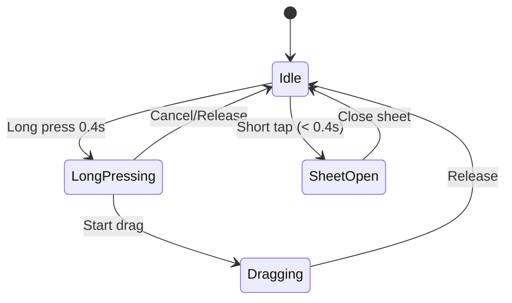

# 🎨 Interactive Parameter Tiles - Visual Guide

## 📱 User Experience Flow

```
┌─────────────────────────────────────────────┐
│  STATE 1: IDLE (Normal)                     │
│                                             │
│  ┌──────┐  ┌──────┐  ┌──────┐              │
│  │ CELL │  │JITTER│  │CONTRA│              │
│  │  🔲  │  │  ⚡  │  │  ☀️  │              │
│  │ 40%  │  │ 20%  │  │ 50%  │              │
│  └──────┘  └──────┘  └──────┘              │
│   85×56pt   85×56pt   85×56pt              │
│   Shadow: light (radius 4)                 │
└─────────────────────────────────────────────┘
                 ↓
         👆 Long Press 0.4s
                 ↓
┌─────────────────────────────────────────────┐
│  STATE 2: ELEVATED (Long Press)             │
│                                             │
│     ┌────────┐                              │
│     │  CELL  │  ← Elevated!                │
│     │   🔲   │  ← Scale 1.21×               │
│     │  40%   │  ← Shadow: strong (r 12)    │
│     └────────┘                              │
│     103×68pt                                │
│                                             │
│  Haptic: Medium (40%) 📳                    │
│  Sound: Click 🔊                            │
└─────────────────────────────────────────────┘
                 ↓
         👈 Drag Horizontally 👉
                 ↓
┌─────────────────────────────────────────────┐
│  STATE 3: DRAGGING (Interactive)            │
│                                             │
│     ┌────────┐                              │
│     │█ CELL  │  ← Progress bar moves        │
│     │█  🔲   │  ← Value updates 0-100%      │
│     │█ 65%   │  ← Preview updates live      │
│     └────────┘                              │
│     Still elevated                          │
│                                             │
│  Haptic: Micro (20%) every 5% 📳           │
│  Preview: Real-time update 🎬              │
└─────────────────────────────────────────────┘
                 ↓
         ✋ Release Finger
                 ↓
┌─────────────────────────────────────────────┐
│  STATE 4: RETURN TO IDLE                    │
│                                             │
│  ┌──────┐  ┌──────┐  ┌──────┐              │
│  │ CELL │  │JITTER│  │CONTRA│              │
│  │  🔲  │  │  ⚡  │  │  ☀️  │              │
│  │ 65%  │  │ 20%  │  │ 50%  │  ← New value!│
│  └──────┘  └──────┘  └──────┘              │
│                                             │
│  Haptic: Medium (40%) 📳                    │
│  Sound: Click 🔊                            │
│  Animation: Smooth spring (0.35s)           │
└─────────────────────────────────────────────┘
```

## 🎭 State Transitions



## 📏 Size Comparison

```
Normal State:
┌─────────────────┐
│                 │
│   CELL   16pt   │  56pt height
│    🔲    12pt   │
│                 │
└─────────────────┘
    85pt width

Elevated State (Scale 1.21×):
┌───────────────────┐
│                   │
│    CELL   18pt    │  68pt height
│     🔲    14pt    │
│                   │
└───────────────────┘
    103pt width
```

## 🎨 Shadow Evolution

```
Normal:
  ████  ← Component
  ░░░░  ← Shadow (opacity 0.25, radius 4)

Elevated:
  ████  ← Component
  ▓▓▓▓
  ▒▒▒▒  ← Shadow (opacity 0.6, radius 12)
  ░░░░
```

## 📊 Progress Bar Visualization

```
0%                                    100%
├──────────────────────────────────────┤

Cell at 40%:
█████████████░░░░░░░░░░░░░░░░░░░░░░░░░

After drag to 65%:
█████████████████████████░░░░░░░░░░░░░░

After drag to 100%:
██████████████████████████████████████
```

## 🎯 Gesture Recognition

```
Touch Timeline:
─────────────────────────────────────►

0.0s    0.4s    0.5s              1.0s
│       │       │                  │
▼       ▼       ▼                  ▼
Touch   Long    Start              Release
Down    Press   Drag               
        ✓       (if moved)         

Scenarios:
1. Tap & Release (< 0.4s)  → Opens sheet
2. Hold (≥ 0.4s) + Release → Elevate + Return
3. Hold + Drag + Release   → Adjust value
```

## 🔊 Haptic & Sound Feedback

```
Event               Haptic          Sound       Intensity
─────────────────────────────────────────────────────────
Long Press Start    Medium          Click       40%  ██
Drag 5% Change      Micro           -           20%  █
Drag 10% Change     Micro           -           20%  █
Drag 15% Change     Micro           -           20%  █
Release             Medium          Click       40%  ██
Short Tap           Medium          Click       40%  ██
```

## 🎬 Animation Timing

```
Scale Animation:
1.0 ─┐
     │    ╱─────── (hold elevated)
     │   ╱
1.21 ────
     │   │
     │   └─── 0.35s spring (damping 0.7)
     
Icon/Font Size Animation:
16pt ─┐
      │    ╱─────── (hold elevated)
      │   ╱
18pt ─────
      │   │
      │   └─── 0.3s spring (damping 0.6)

Shadow Animation:
4r ──┐
     │    ╱─────── (hold elevated)
     │   ╱
12r ─────
     │   │
     │   └─── 0.35s spring (damping 0.7)
```

## 💡 Design Tokens Used

```swift
// Colors
DesignColor.mainGrey     // Background: #1A1A1A
DesignColor.greyActive   // Progress: #252525
DesignColor.white        // Icon & Text
DesignColor.black        // Shadow

// Spacing
DesignSpacing.s          // 4pt (icon-text gap)
DesignSpacing.md         // 12pt (border radius)

// Radius
DesignRadius.md          // 12pt

// Typography
IBM Plex Mono Medium
- Normal: 12pt
- Elevated: 14pt

// Shadows
Normal:
  - opacity: 0.25
  - radius: 4
  - offset: (0, 0)

Elevated:
  - opacity: 0.6
  - radius: 12
  - offset: (0, 0)
```

## 🧪 Test Scenarios

### ✅ Positive Tests
1. Long press → elevates smoothly
2. Drag left → decreases value
3. Drag right → increases value
4. Release → returns to normal + saves value
5. Short tap → opens sheet
6. Drag beyond bounds → clamps to 0-100%

### ⚠️ Edge Cases
1. Rapid tap (< 0.1s) → Opens sheet
2. Hold + no drag → Elevates + returns
3. Drag very fast → Smooth tracking
4. Drag outside component → Still works
5. Multi-touch → Only first touch counts

### 📱 Device Tests
- iPhone SE (small screen)
- iPhone 15 Pro (notch)
- iPhone 15 Pro Max (largest)
- iPad (different layout)
- Dark mode / Light mode
- Accessibility: Large text
- Accessibility: Reduce motion

---

**Visual Guide Created:** December 6, 2025
**Status:** Ready for Testing 🚀

